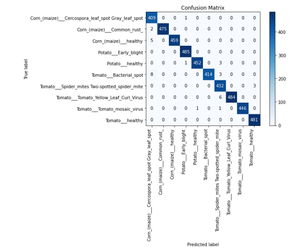
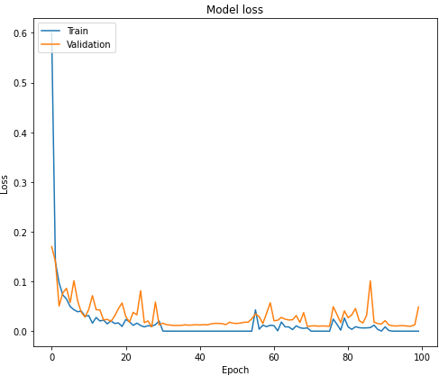
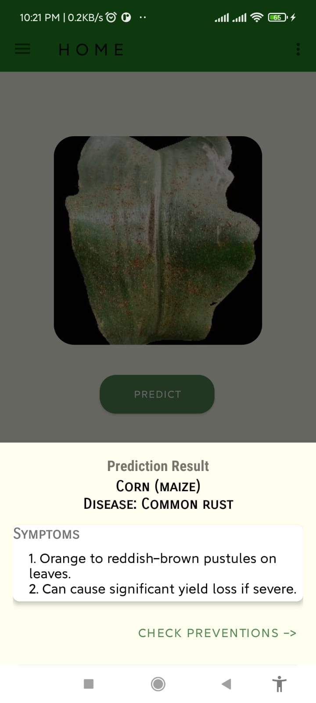
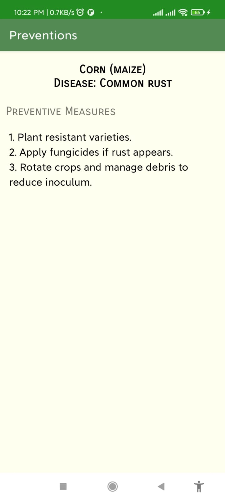

# **Plant Disease Identification System using Deep Learning**

## **Table of Contents**
1. [Overview](#overview)
2. [Features](#features)
3. [Project Structure](#project-structure)
4. [Models](#models)
5. [Installation](#installation)
6. [Usage](#usage)
7. [Results](#results)
8. [App Screenshots](#app-screenshots)
9. [Model Graphs](#model-graphs)
10. [Future Work](#future-work)
11. [Contributing](#contributing)
12. [License](#license)

---

## **Overview**
The Plant Disease Identification System is an AI-powered mobile application that uses Deep Learning to accurately detect plant diseases from images. The goal is to assist farmers and agricultural professionals by providing an easy-to-use tool for real-time plant disease diagnosis. The system leverages Convolutional Neural Networks (CNNs) for image classification and has been trained on various plant disease datasets, including potato, tomato, and corn.

---

## **Features**
- **Real-Time Disease Detection**: Upload images or capture in real-time to detect plant diseases.
- **Custom CNN Model**: A custom-built deep learning model tailored for plant disease identification.
- **Pre-trained Models**: VGG19, GoogleNet, SqueezeNet, and MobileNet are integrated for comparison.
- **Multi-Class Classification**: Identifies multiple diseases across various plant types.
- **Predictive Measures**: Provides recommendations on disease prevention and management.

---

## **Project Structure**
```
├── app/
│   ├── MainActivity.java
│   ├── DiseaseDetection.java
│   └── XML Layout Files/
│
├── models/
│   ├── Custom_CNN_Model.py
│   ├── VGG19_Model.py
│   ├── GoogleNet_Model.py
│   └── SqueezeNet_Model.py
│
├── data/
│   ├── train/
│   ├── validation/
│   └── test/
│
├── results/
│   ├── model_graphs/
│   ├── confusion_matrices/
│   └── accuracy_loss_plots/
│
├── README.md
└── requirements.txt
```

---

## **Models**
### 1. **Custom CNN Model**
- The custom CNN model was designed specifically for this project, focusing on identifying plant diseases using image data. It consists of convolutional, pooling, and fully connected layers, with dropout and batch normalization for regularization.
  
### 2. **Pre-trained Models**
- **VGG19**: Known for its deep architecture, it excels in image classification tasks.
- **GoogleNet (Inception v1)**: An optimized model that balances accuracy with computational efficiency.
- **SqueezeNet**: A lightweight model designed for mobile and embedded vision tasks.
- **MobileNet**: Optimized for mobile devices with efficient depthwise separable convolutions.

---

## **Installation**

### **Requirements**
- Python 3.x
- TensorFlow
- Keras
- NumPy
- Pandas
- OpenCV
- Android Studio (for app development)

### **Steps to Install**
1. Clone the repository:
   ```bash
   git clone https://github.com/your-username/PlantDiseaseIdentificationSystem.git
   cd PlantDiseaseIdentificationSystem
   ```

2. Install the required Python libraries:
   ```bash
   pip install -r requirements.txt
   ```

3. Set up Android Studio:
   - Open the `app/` folder in Android Studio.
   - Ensure the necessary SDK and libraries are installed.

---

## **Usage**

### **Training the Models**
1. To train the custom CNN model:
   ```bash
   python models/Custom_CNN_Model.py
   ```

2. To train other pre-trained models:
   ```bash
   python models/VGG19_Model.py
   ```

### **Running the App**
- Open Android Studio and run the project on an emulator or a connected device.

### **Using the App**
- Upload an image or use the camera to capture a plant leaf.
- Click "Predict" to get the disease diagnosis.
- View predictive measures and recommendations on disease management.

---

## **Results**

### **Confusion Matrix**
The confusion matrix shows how well the model predicted each class for the test data.

### **Accuracy and Loss**
The training and validation accuracy and loss plots provide insights into the model's learning process.

---

## Screenshots







---

## **Future Work**
- **Dataset Expansion**: Incorporating additional plant species and disease types.
- **Advanced Analytics**: Implement predictive analytics for early detection of disease outbreaks.
- **Real-Time Monitoring**: Integrate IoT and sensor-based technologies for continuous crop monitoring.
- **Improved Model Efficiency**: Further compression of models for enhanced performance on mobile devices.

---

## **Contributing**
If you'd like to contribute to this project, please fork the repository and create a pull request with detailed changes.

---

## **License**
This project is licensed under the MIT License.

---

Feel free to adjust the details and paths as per your actual file structure. This template provides a solid foundation for showcasing your project effectively.
